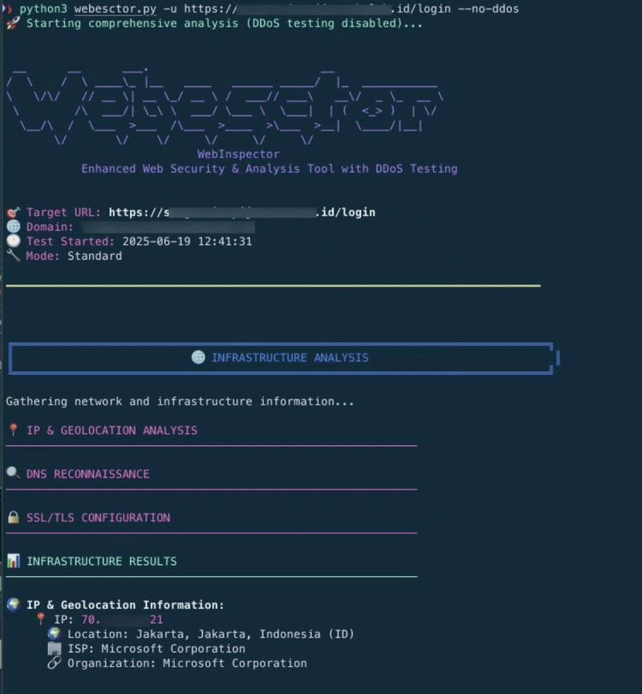

# 🔍 WEBESCTOR

[](https://github.com/rdoix/webesctor)


**Enhanced Web Security & Analysis Tool with DoS Protection Testing**

A comprehensive web application security testing and reconnaissance tool designed for security professionals, penetration testers, and DevOps teams to evaluate WAF effectiveness and DoS protection mechanisms.




## ✨ Features

### 🛡️ **Security Testing**
- **WAF Detection & Bypass Testing** - Comprehensive testing against various attack vectors
- **DoS Protection Testing** - High-volume traffic simulation to test anti-DoS mechanisms
- **Security Headers Analysis** - OWASP security headers validation
- **Vulnerability Scanning** - Common web vulnerabilities detection

### 📊 **Performance Analysis**
- **Baseline Performance Testing** - Establish application performance metrics
- **Load Testing** - Multi-threaded stress testing capabilities
- **Real-time Progress Tracking** - Visual progress indicators for all tests
- **Detailed Metrics** - Latency, throughput, and response analysis

### 🌐 **Infrastructure Reconnaissance**
- **IP Geolocation Analysis** - Detailed geographic and ISP information
- **DNS Information Gathering** - Comprehensive DNS record enumeration
- **SSL/TLS Configuration Testing** - Certificate and cipher analysis
- **CDN/WAF Detection** - Identify protection services (Cloudflare, AWS, Akamai, etc.)

### 📈 **Reporting & Analysis**
- **Comprehensive Security Scoring** - Overall security posture assessment
- **JSON Export** - Machine-readable results for automation
- **Real-time Monitoring Recommendations** - Actionable insights for security teams
- **Color-coded Terminal Output** - Easy-to-read results with visual indicators

## 🚀 Quick Start

### Prerequisites

- Python 3.7 or higher
- pip package manager
- Internet connectivity for geolocation services

### Installation

1. **Clone the repository:**
```bash
git clone https://github.com/rdoix/webesctor.git
cd webesctor
```

2. **Install dependencies:**
```bash
pip install requests dnspython statistics
```

3. **Run basic test:**
```bash
python webesctor.py -u https://example.com
```

## 📋 Requirements

### Python Dependencies

```txt
requests>=2.28.0
dnspython>=2.2.0
statistics>=1.0.3.5
```

### System Requirements

- **Memory:** Minimum 2GB RAM (4GB+ recommended for aggressive testing)
- **Network:** Stable internet connection
- **Permissions:** Ability to make outbound HTTP/HTTPS connections
- **Python:** Version 3.7+ with ssl and socket modules

## 🛠️ Usage

### Basic Usage

```bash
# Simple WAF and security test
python webesctor.py -u https://target.com

# Verbose output with detailed information
python webesctor.py -u https://target.com -v

# Test without DoS protection testing
python webesctor.py -u https://target.com --no-DoS
```

### Advanced DoS Testing

```bash
# Custom DoS test parameters
python webesctor.py -u https://target.com -D 120 -R 1000 -T 100

# Aggressive testing (use with caution!)
python webesctor.py -u https://target.com -D 60 -R 2000 -T 150 -v
```

### Performance Testing

```bash
# Custom baseline and load testing
python webesctor.py -u https://target.com -b 100 -l 20 -r 50
```

## 🎯 Command Line Options

### Basic Options
| Flag | Long Form | Description |
|------|-----------|-------------|
| `-u` | `--url` | Target URL to analyze (required) |
| `-v` | `--verbose` | Enable verbose output |

### Testing Configuration
| Flag | Long Form | Default | Description |
|------|-----------|---------|-------------|
| `-b` | `--baseline-requests` | 50 | Number of requests for baseline test |
| `-l` | `--load-threads` | 10 | Number of threads for load testing |
| `-r` | `--load-requests` | 20 | Requests per thread for load testing |

### DoS Testing Options
| Flag | Long Form | Default | Description |
|------|-----------|---------|-------------|
| | `--no-DoS` | False | Disable DoS protection testing |
| `-D` | `--DoS-duration` | 60 | DoS test duration in seconds |
| `-R` | `--DoS-rps` | 500 | Target requests per second for DoS test |
| `-T` | `--DoS-threads` | 50 | Number of threads for DoS test |

## 🧪 Testing Scenarios

### 1. WAF Effectiveness Testing

WEBESCTOR Pro tests against various attack vectors:

- **SQL Injection** - UNION attacks, boolean-based, time-based
- **Cross-Site Scripting (XSS)** - Reflected, stored, DOM-based
- **Command Injection** - System command execution attempts
- **Path Traversal** - Directory traversal attacks
- **Code Injection** - Server-side code execution
- **Template Injection** - Server-side template injection

### 2. DoS Protection Testing

Simulates realistic DoS attack patterns:

- **High-volume traffic generation** with configurable RPS
- **Multi-threaded concurrent requests** 
- **Randomized attack patterns** (paths, user agents, IPs)
- **Real-time protection detection**
- **Rate limiting identification**

### 3. Security Posture Assessment

Comprehensive security analysis:

- **Security headers validation** (HSTS, CSP, X-Frame-Options, etc.)
- **SSL/TLS configuration review**
- **Information disclosure detection**
- **Overall security scoring**

## 📊 Output & Reporting

### Terminal Output

Real-time colored output with:
- 🟢 **Success indicators** for passed tests
- 🟡 **Warning indicators** for potential issues  
- 🔴 **Failure indicators** for security gaps
- 📊 **Progress bars** for long-running tests

### JSON Export

Detailed machine-readable results saved to:
```
webesctor_results_[domain]_[timestamp].json
```

### Key Metrics

- **Security Score** - Overall security posture (0-100)
- **WAF Block Rate** - Percentage of malicious requests blocked
- **DoS Protection Status** - Active/Inactive with trigger timing
- **Performance Baseline** - Response time and throughput metrics

## ⚠️ Safety & Legal Considerations

### 🚨 Important Warnings

- **Only test systems you own or have explicit permission to test**
- **DoS testing can impact service availability**
- **Always inform your team before conducting aggressive tests**
- **Monitor target systems during testing**
- **Have rollback procedures ready**

### 🛡️ Recommended Testing Approach

1. **Start with basic tests** (`--no-DoS` flag)
2. **Gradually increase intensity** 
3. **Monitor target system health**
4. **Test during maintenance windows**
5. **Coordinate with infrastructure teams**

### 📋 Pre-Testing Checklist

- [ ] Verify you have permission to test the target
- [ ] Inform relevant teams about testing schedule
- [ ] Set up monitoring for target system
- [ ] Prepare incident response procedures
- [ ] Test in staging environment first

## 🎯 Use Cases

### For Security Teams
- **WAF rule validation** and effectiveness testing
- **DoS protection verification** and threshold testing
- **Security posture assessment** and gap analysis
- **Incident response preparation** and testing

### For DevOps Teams
- **Application security validation** in CI/CD pipelines
- **Performance baseline establishment**
- **Infrastructure security verification**
- **Monitoring and alerting validation**

### For Penetration Testers
- **Initial reconnaissance** and fingerprinting
- **WAF bypass technique testing**
- **Security control validation**
- **Comprehensive security assessment**

## 🤝 Contributing

Welcome contributions!

### Development Setup

```bash
# Clone your fork
git clone https://github.com/yourusername/webesctor.git
cd webesctor

# Create virtual environment
python -m venv venv
source venv/bin/activate  # Linux/macOS
# or
venv\Scripts\activate     # Windows

# Install development dependencies
pip install -r requirements.txt
pip install -r requirements-dev.txt
```

## 🆘 Troubleshooting

### Common Issues

**Issue:** `ModuleNotFoundError: No module named 'dns'`
```bash
# Solution
pip install dnspython
```

**Issue:** SSL verification errors
```bash
# Solution - the tool handles SSL verification automatically
# Check your network connectivity and target server SSL configuration
```

**Issue:** High memory usage during DoS testing
```bash
# Solution - reduce thread count and RPS
python webesctor.py -u https://target.com -T 25 -R 250
```

**Issue:** Connection timeouts
```bash
# Solution - check target availability and network connectivity
# Try with verbose flag for more details
python webesctor.py -u https://target.com -v
```

## ⚖️ Disclaimer

This tool is intended for legitimate security testing and educational purposes only. Users are responsible for ensuring they have proper authorization before testing any systems. The authors are not responsible for any misuse or damage caused by this tool.

---

*Star ⭐ this repository if you find it useful!*
